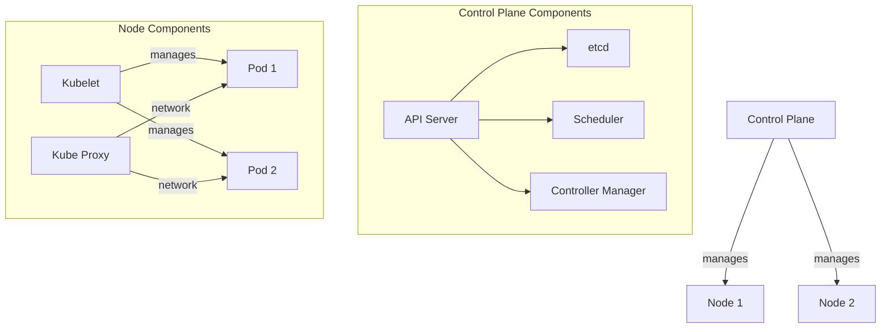
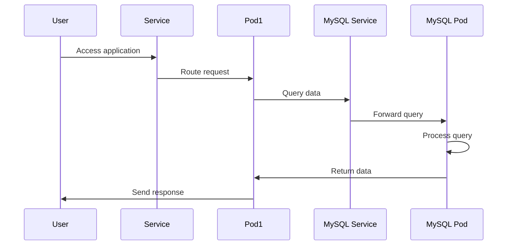

# Kubernetes Configuration Guide

## Kubernetes Architecture

### Components Overview



### 1. Control Plane (Master Node)

- **API Server**:

  - Central communication hub
  - Validates and processes all REST requests
  - Entry point for all administrative tasks

- **etcd**:

  - Distributed key-value store
  - Stores all cluster data
  - Maintains configuration and state

- **Scheduler**:

  - Assigns pods to nodes
  - Considers resource requirements
  - Handles pod placement strategy

- **Controller Manager**:
  - Manages various controllers
  - Ensures desired state is maintained
  - Handles node, replication, endpoints controllers

### 2. Node Components

- **Kubelet**:

  - Primary node agent
  - Ensures containers are running in pods
  - Reports node and pod status

- **Kube Proxy**:
  - Maintains network rules
  - Enables pod-to-pod communication
  - Handles service abstraction

### 3. Data Flow



### 4. Multi-Node Setup

Currently using Docker Desktop's single-node cluster. To create multi-node clusters:

1. **Using Kind**:

```yaml
# kind-config.yaml
kind: Cluster
apiVersion: kind.x-k8s.io/v1alpha4
nodes:
  - role: control-plane
  - role: worker
  - role: worker
```

2. **Using k3d**:

```bash
# Create a cluster with 2 worker nodes
k3d cluster create mycluster --agents 2
```

3. **Check Nodes**:

```bash
# List all nodes
kubectl get nodes

# Get detailed node information
kubectl describe node <node-name>
```

## Project Structure

```bash
kubernetes/
├── web/
│   ├── deployment.yaml    # Web application deployment
│   └── service.yaml      # Web application service
├── mysql/
│   ├── deployment.yaml   # MySQL database deployment
│   ├── service.yaml     # MySQL service
│   ├── pvc.yaml        # Persistent Volume Claim
│   └── secret.yaml     # MySQL credentials
└── configmap.yaml      # Environment variables
```

## Components Explained

### 1. Deployment (deployment.yaml)

Manages the lifecycle of containerized applications.

```yaml
apiVersion: apps/v1 # Kubernetes API version
kind: Deployment # Resource type
metadata: # Resource metadata
  name: web-deployment # Resource name
spec: # Deployment specifications
  replicas: 2 # Number of pod copies to run
  selector: # How deployment finds pods to manage
    matchLabels: # Must match pod template labels
      app: web
  template: # Pod template
    metadata: # Pod metadata
      labels: # Labels for pod selection
        app: web
    spec: # Pod specifications
      containers: # List of containers in pod
        - name: web # Container name
          image: docker-demo-app:latest # Docker image
          ports: # Container ports
            - containerPort: 3000 # Port exposed by container
```

### 2. Service (service.yaml)

Exposes applications running in pods.

```yaml
apiVersion: v1 # Kubernetes API version
kind: Service # Resource type
metadata: # Resource metadata
  name: web-service # Service name
spec: # Service specifications
  type: ClusterIP # Service type (ClusterIP, NodePort, LoadBalancer)
  ports: # Port mappings
    - port: 80 # Port exposed by service
      targetPort: 3000 # Port on pod to forward to
  selector: # Labels to select pods
    app: web # Must match pod labels
```

### 3. PersistentVolumeClaim (pvc.yaml)

Requests storage resources.

```yaml
apiVersion: v1 # Kubernetes API version
kind: PersistentVolumeClaim # Resource type
metadata: # Resource metadata
  name: mysql-pvc # PVC name
spec: # PVC specifications
  accessModes: # How volume can be mounted
    - ReadWriteOnce # Read-write by single node
  resources: # Resource requirements
    requests: # Storage request
      storage: 1Gi # Amount of storage
```

### 4. Secret (secret.yaml)

Stores sensitive information.

```yaml
apiVersion: v1 # Kubernetes API version
kind: Secret # Resource type
metadata: # Resource metadata
  name: mysql-secret # Secret name
type: Opaque # Secret type
data: # Secret data (must be base64 encoded)
  username: dXNlcg== # base64 encoded 'user'
  password: cGFzc3dvcmQ= # base64 encoded 'password'
```

## Common Operations

### Deploy Applications

```bash
# Apply all configurations
kubectl apply -f kubernetes/

# Apply specific configuration
kubectl apply -f kubernetes/web/deployment.yaml
```

### View Resources

```bash
# List all pods
kubectl get pods

# List all services
kubectl get services

# List all deployments
kubectl get deployments
```

### View Logs

```bash
# View pod logs
kubectl logs <pod-name>

# Follow pod logs
kubectl logs -f <pod-name>
```

### Scale Applications

```bash
# Scale web deployment
kubectl scale deployment web-deployment --replicas=3
```

## Configuration Details

### Web Application

- **Replicas**: 2 pods for high availability
- **Port**: 3000 (Node.js application)
- **Environment Variables**: Configured via ConfigMap
- **Database Connection**: Via MySQL service

### MySQL Database

- **Replicas**: 1 pod (stateful application)
- **Port**: 3306 (MySQL default)
- **Persistence**: Uses PVC for data storage
- **Credentials**: Stored in Secrets

## Networking

- Web service exposed on port 80
- MySQL service internal only
- All services in same Kubernetes network
- Inter-service communication via service names

## Storage

- MySQL data persisted using PVC
- Storage class: default
- Access mode: ReadWriteOnce
- Size: 1Gi

## Security

- Sensitive data in Secrets
- Database credentials encrypted
- Internal service communication only
- No direct database exposure

## Troubleshooting

### Common Issues

1. **Pods not starting**

   - Check events: `kubectl describe pod <pod-name>`
   - Check logs: `kubectl logs <pod-name>`

2. **Database connection issues**

   - Verify service: `kubectl get service mysql-service`
   - Check credentials in secrets
   - Verify environment variables in pods

3. **Storage issues**
   - Check PVC status: `kubectl get pvc`
   - Verify storage class: `kubectl get sc`

### Health Checks

```bash
# Check pod health
kubectl get pods -o wide

# Check service endpoints
kubectl get endpoints

# View pod details
kubectl describe pod <pod-name>
```

## Node Management and Scaling

### Current Environment

Docker Desktop provides a single-node Kubernetes cluster by default:

```bash
# Check current nodes
kubectl get nodes
# You'll see one node: docker-desktop
```

### Creating Multi-Node Clusters

1. **Install Required Tools**:

   ```bash
   # Install Kind
   curl.exe -Lo kind-windows-amd64.exe https://kind.sigs.k8s.io/dl/v0.20.0/kind-windows-amd64
   Move-Item .\kind-windows-amd64.exe c:\windows\system32\kind.exe

   # Or install k3d
   curl -s https://raw.githubusercontent.com/k3d-io/k3d/main/install.ps1 | powershell
   ```

2. **Create Multi-Node Cluster**:

   Using Kind:

   ```bash
   # Create config file
   @"
   kind: Cluster
   apiVersion: kind.x-k8s.io/v1alpha4
   nodes:
   - role: control-plane
   - role: worker
   - role: worker
   "@ > kind-config.yaml

   # Create cluster
   kind create cluster --config kind-config.yaml
   ```

   Using k3d:

   ```bash
   # Create 3-node cluster
   k3d cluster create mycluster --agents 2
   ```

### Node Operations

```bash
# List all nodes with details
kubectl get nodes -o wide

# Get node information
kubectl describe node <node-name>

# Check node resource usage
kubectl top node

# Drain node for maintenance
kubectl drain <node-name> --ignore-daemonsets

# Mark node as unschedulable
kubectl cordon <node-name>

# Mark node as schedulable
kubectl uncordon <node-name>
```

### Application Scaling

1. **Horizontal Pod Scaling**:

   ```bash
   # Manual scaling
   kubectl scale deployment web-deployment --replicas=4

   # Automatic scaling (if metrics server is installed)
   kubectl autoscale deployment web-deployment --min=2 --max=5 --cpu-percent=80
   ```

2. **Check Scaling Status**:

   ```bash
   # View deployment status
   kubectl get deployment web-deployment

   # View HorizontalPodAutoscaler status
   kubectl get hpa

   # View pod distribution across nodes
   kubectl get pods -o wide
   ```

3. **Load Balancing**:
   - Service automatically load balances between pods
   - New pods are distributed across available nodes
   - Health checks ensure traffic goes to healthy pods
